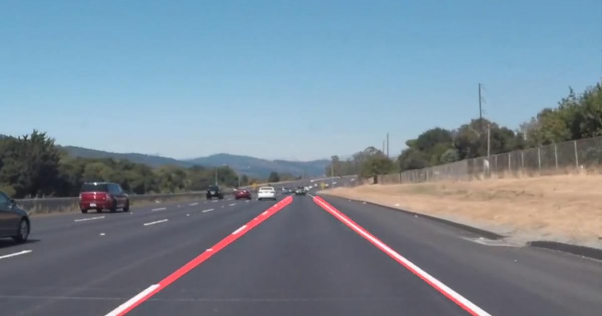

# **Finding Lane Lines on the Road** 

## Writeup 

---

**Finding Lane Lines on the Road**

The goals / steps of this project are the following:
* Make a pipeline that finds lane lines on the road
* Reflect on your work in a written report

---

### Reflection

### 1. Describe your pipeline. As part of the description, explain how you modified the draw_lines() function.

My pipeline consisted in 6 steps. First, I converted the images to grayscale, then I used the function GaussianBlur with kernel size equal to 5 to reduce image noise and reduce details. Later, I used canny transformation to find lines. Moreover, I used Hough transformation that returns an image with hough lines drawn. After, I used the draw_lines function to extrapolate two main lines that I chose with respect to its slope. Finally, I used weighted_img function to combine the two last lines with the original image.

In order to draw a single line on the left and right lanes, I modified the draw_lines function by using equation line to extrapolate. I chose these lines with respect to their slope. For example, the left line should be with the greatest slope and the rigth line should be with the lowest slope. Finally, I used weighted_img function to combine the two last lines with the original image.

I would like to show an image when I ran all of pipeline.

### 2. Identify potential shortcomings with your current pipeline

One potential shortcoming would be what would happen when left line and right line have the same slope. Because, I just choose one line by positive slope and one line by negative slope.

Another shortcoming could be if left line and right could not be recognized when I perform Hough Transformation.

### 3. Suggest possible improvements to your pipeline

A possible improvement would be to choose another a better way to find the left and right line perfectly.